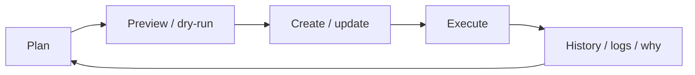

<p align="center">
  
</p>

<h1 align="center">locron</h1>

<p align="center">
  <strong>Cron that explains itself.</strong><br>
  A local-first scheduler for developers and automation agents on macOS and Linux.
</p>

<p align="center">
  <a href="https://github.com/WhiteKiwi/locron/actions/workflows/ci.yml"></a>
  <a href="https://github.com/WhiteKiwi/locron/releases"></a>
  <a href="#license"></a>
</p>

`locron` schedules process, shell, and HTTP work, then keeps the durable facts needed to operate
it: what was due, what ran, what was skipped, what it produced, and why it reached its current
state. Human-readable commands, versioned machine output, and the optional dashboard and MCP server
all use the same scheduling model.

## See the workflow

Create a job, preview its schedule, run it, inspect the result, and ask what the scheduler knows:

```sh
locron add backup --every 1h -- /bin/echo backup-complete
locron preview backup --count 2
locron run backup
locron history backup
locron explain backup
```

`explain` combines the job's schedule and current eligibility with its latest run and latest
anomalous terminal run. For the full attempt and event trace, use the canonical run ID printed by
`run` or returned by `history --format json`:

```sh
locron why --run <RUN_ID>
locron logs <RUN_ID>
```

Job-level `why` shows policies, the durable schedule cursor, daemon availability, and current
admission facts. `doctor` checks the daemon, state directory, database, execution path, and target
resolution.

```sh
locron why backup
locron doctor
```

Downtime explanations come from durable schedule cursors, daemon lifetime records, and
reconciliation events. locron does not claim to detect when a machine was asleep.

## Install

**Homebrew (macOS and Linux):**

```sh
brew install whitekiwi/tap/locron
```

**Install script (macOS and Linux):**

```sh
curl -fsSL https://locron.whitekiwi.link/install.sh | sh
```

The short URL redirects to the canonical
`https://github.com/WhiteKiwi/locron/releases/latest/download/install.sh` release asset.

**Cargo (Rust 1.94 or newer, source build):**

```sh
cargo install --locked locron
```

Cargo does not register the daemon or dashboard automatically. Enable either explicitly with
`locron service install` or `locron dashboard enable`. Update with
`cargo install --locked locron`, remove with `cargo uninstall locron`, and do not use
`locron self-update` for a Cargo installation.

**Or ask Claude Code:**

```sh
claude "Install locron: https://github.com/WhiteKiwi/locron"
```

Review and approve each command it proposes. Every channel — packages, tarballs, building from
source, updating, and uninstalling — is covered in the [Installation Guide](docs/INSTALL.md).

## Why a local scheduler needs operational state

Scheduling a command is simple. Operating scheduled work on a laptop is not: machines sleep and
reboot, networks disappear, processes crash, occurrences are missed, and runs overlap. locron
treats those conditions as normal inputs to the scheduler rather than leaving them implicit.

| Condition | Recorded behavior |
|---|---|
| An occurrence became due while locron was unavailable | `skip`, `latest`, or bounded `all` missed-run policy |
| The previous run is still active | `skip`, `replace`, or bounded `allow` overlap policy |
| An attempt failed or timed out | Explicit timeout and retry policy, with attempts kept on one durable run |
| A process must stop | Process-group cancellation and a configurable termination grace period |
| The daemon stopped mid-run | Startup reconciliation records an honest interrupted or uncertain outcome |
| Output exceeds retention limits | Bounded capture and explicit truncation or pruning facts |

locron does not promise exactly-once external effects. When a crash makes an outcome unknowable,
it preserves that uncertainty instead of assuming success or blindly repeating the work. Targets
that require stronger duplicate protection can use the durable run ID as an idempotency key.

Declare the relevant behavior with the job:

```sh
locron add sync --every 15m \
  --missed-run latest \
  --overlap skip \
  --timeout 10m \
  -- /usr/local/bin/sync-data
```

See the [Operator Guide](docs/OPERATOR.md) for policy details and recovery procedures.

## One model for people and automation

The readable CLI and optional loopback-only dashboard are human views over the same durable jobs
and runs used by automation. CLI commands can instead return the versioned `locron.cli/v1` JSON
envelope. Mutations such as job changes, manual runs, imports, and pruning provide non-mutating
dry-run paths.



```sh
locron add test-job --cron "0 12 * * *" --dry-run -- /usr/bin/true
locron run backup --dry-run
locron history backup --format json
locron why backup --format json
```

`locron mcp` serves the [Model Context Protocol](https://modelcontextprotocol.io) over stdio. It
exposes **13 tools**, **5 resources**, and **2 prompts** through the same validation, redaction, and
durable application boundary as the CLI; every mutating tool accepts `"dry_run": true`.

Register it with any MCP client using the same entry — `claude_desktop_config.json` for Claude
Desktop, or `.cursor/mcp.json` / Cursor Settings → MCP for Cursor:

```json
{
  "mcpServers": {
    "locron": {
      "command": "locron",
      "args": ["mcp"]
    }
  }
}
```

If `locron` is not on the client's `PATH`, use an absolute path. See the
[MCP Specification](docs/mcp/SPEC.md) for the complete contract and the
[locron Agent Skill](https://github.com/WhiteKiwi/skills) for a guided, dry-run-first workflow.

## Start scheduling

First, check the daemon:

```sh
locron service status
```

The install script registers the daemon as a login service and starts it for you. Homebrew installs
never auto-start; run `brew services start locron` once instead. For manual control,
`locron daemon run` runs it in the foreground. See
[service setup](docs/OPERATOR.md#run-the-daemon-as-a-service) for the complete lifecycle.

Then add any supported schedule and target combination:

```sh
# Direct process every 15 minutes
locron add fetch-repo --every 15m -- git -C ~/projects/app fetch

# Explicit shell command nightly at 03:00 Seoul time
locron add nightly-backup --cron "0 3 * * *" --timezone Asia/Seoul --shell "./scripts/backup.sh"

# HTTP request every 5 minutes
locron add health-check --every 5m --http GET https://example.com/health

# One-time execution at a specific instant
locron add deploy-task --at 2026-09-01T09:00:00+09:00 -- /usr/local/bin/deploy
```

Schedules are five-field cron expressions, fixed intervals, or one-time timestamps with an explicit
offset. Targets are direct processes, explicitly requested shell commands, or HTTP requests. List,
preview, run, inspect, and remove a job with:

```sh
locron list
locron preview backup
locron run backup --wait
locron history backup
locron remove backup
```

State lives in `~/.local/share/locron` (or `$XDG_DATA_HOME/locron`) and can be overridden with
`--state-dir` or `LOCRON_STATE_DIR`.

## How locron fits

cron is a compact, portable primitive for deciding when a command is due. launchd and systemd are
native service managers that can keep programs such as the locron daemon available. locron does
not translate each job into those systems. It owns one consistent macOS/Linux model for schedules,
jobs, runs, attempts, policies, captured output, history, and explanations.

That boundary is deliberate: operating-system service managers supervise locron itself; locron
schedules and supervises the individual targets.

## Architecture at a glance

```text
CLI ───────┐
Dashboard ─┼─> shared validation and application boundary
MCP ───────┘                │
                   ┌────────┴────────┐
                   v                 v
       durable SQLite state <─> scheduling and supervision
                                      /      |      \
                                 process   shell    HTTP
```

The engine creates a durable run and attempt before external execution, reconciles incomplete work
after restart, and supervises process groups without holding a database transaction across target
execution. SQLite runs in WAL mode with atomic migrations and stores explicit job, run, attempt,
event, and scheduler-lifetime facts. See [Architecture](docs/ARCHITECTURE.md) for the component
boundaries and persistence invariants.

## Open the local dashboard

The optional dashboard shows the same durable jobs, runs, settings, and diagnostics as the CLI. It
is **off by default**, listens only on this machine's loopback interface, and does not replace or
control the scheduler daemon.

```sh
locron dashboard
```

Open the printed `http://127.0.0.1:10824/` URL (the port may advance when the default is busy), then
paste the printed access token into the entry page. The token never belongs in the URL. Later visits
reuse the browser session; re-display the token intentionally with `locron dashboard token`.

To keep the dashboard available after login, register its separate per-user service:

```sh
locron dashboard enable
locron dashboard status
```

`status` reports the local URL and service posture without exposing the token. Use
`locron dashboard disable` to stop and unregister the service. See the
[dashboard operator guide](docs/OPERATOR.md#web-dashboard) for security and troubleshooting and the
[CLI Reference](docs/CLI.md#dashboard-web-administration) for the exact command and API contracts.

## Documentation

- **[Brand Guide](DESIGN.md)** — voice, visual system, components, motion, and accessibility.
- **[Installation Guide](docs/INSTALL.md)** — install channels, updates, and uninstalling.
- **[Operator Guide](docs/OPERATOR.md)** — daily operations, policies, and troubleshooting.
- **[CLI Reference](docs/CLI.md)** — every command, option, and output contract.
- **[Architecture](docs/ARCHITECTURE.md)** — system design, invariants, and durable state.
- **[MCP Specification](docs/mcp/SPEC.md)** — tools, resources, and prompts.
- **[Web Dashboard Specification](docs/dashboard/SPEC.md)** — loopback viewer and management API.
- **[Release Policy](docs/RELEASE.md)** — versioning, packaging, and release automation.
- **[Changelog](CHANGELOG.md)** — notable changes in each release.

## Contributing

Contributions are welcome. `locron` is developed **documentation-first** — planning documents
change before code — so please read [CONTRIBUTING.md](CONTRIBUTING.md) before opening a pull
request.

- [Report a bug or propose a feature](https://github.com/WhiteKiwi/locron/issues/new/choose)
- [Report a security vulnerability privately](https://github.com/WhiteKiwi/locron/security/advisories/new)
  — never in a public issue ([SECURITY.md](SECURITY.md))

This project follows the [Contributor Covenant](CODE_OF_CONDUCT.md) code of conduct.

## License

Dual-licensed under either of:

- MIT License ([LICENSE-MIT](LICENSE-MIT))
- Apache License, Version 2.0 ([LICENSE-APACHE](LICENSE-APACHE))

at your option.

### Contribution

Unless you explicitly state otherwise, any contribution intentionally submitted for inclusion in
the work by you, as defined in the Apache-2.0 license, shall be dual licensed as above, without any
additional terms or conditions.
